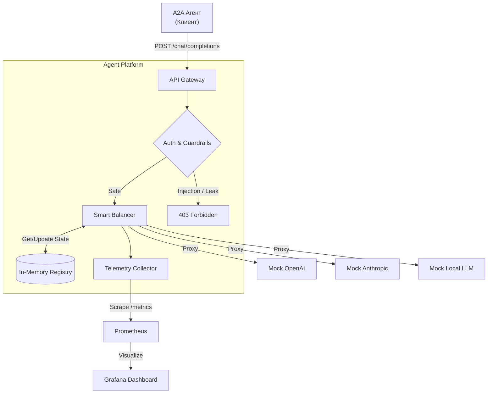

# 🌌 Agent Platform

[](https://nodejs.org/)
[](https://react.dev/)
[](https://www.docker.com/)
[](https://prometheus.io/)

**Agent Platform** — это единый AI Gateway и балансировщик для A2A (Agent-to-Agent) взаимодействий. Платформа предоставляет умную маршрутизацию запросов к LLM-провайдерам (OpenAI, Anthropic, Local), встроенные механизмы защиты (Guardrails) и подробную телеметрию (TTFT, TPOT, Cost).

## 📋 Содержание

- [Архитектура](#-архитектура)
- [Как это работает](#-как-это-работает)
- [Быстрый запуск (Docker)](#-быстрый-запуск-docker)
- [Локальная разработка](#-локальная-разработка)
- [Взаимодействие с платформой](#-взаимодействие-с-платформой)
- [Структура проекта](#-структура-проекта)
- [Документация](#-документация)

## 🏗️ Архитектура



Платформа построена как **Stateless Proxy**. Она принимает запросы от агентов, проверяет их на безопасность, умно балансирует нагрузку между LLM-провайдерами и возвращает результат, параллельно собирая метрики.

## ⚙️ Как это работает

1. **Агент отправляет запрос** на единый эндпоинт `/api/v1/chat/completions` с Bearer-токеном.
2. **Guardrails** проверяют промпт на наличие инъекций (например, *"ignore previous instructions"*) и утечек секретов (AWS/OpenAI ключи).
3. **Smart Balancer** анализирует доступных провайдеров для запрошенной модели и выбирает оптимального на основе приоритета и исторической задержки (Latency-based routing).
4. Если провайдер недоступен (ошибки 5xx), он временно помечается как `unhealthy` и исключается из пула (Health-aware routing).
5. Ответ стримится обратно агенту, а **Telemetry Collector** собирает метрики (TTFT, TPOT, токены, стоимость) и отдает их в Prometheus.

## 🐳 Быстрый запуск (Docker)

Самый простой способ запустить платформу вместе с Prometheus и Grafana — использовать Docker Compose.

1. Склонируйте или экспортируйте репозиторий.
2. Запустите сборку и старт контейнеров:
   ```bash
   docker-compose up --build -d
   ```
3. Платформа будет доступна по следующим адресам:
   - **Control Panel (UI):** `http://localhost:3000`
   - **API Gateway:** `http://localhost:3000/api/v1/...`
   - **Prometheus:** `http://localhost:9090`
   - **Grafana:** `http://localhost:3001` (логин/пароль: `admin` / `admin`)

## 🖥️ Локальная разработка

Для локального запуска без Docker (только Node.js сервер и React UI):

1. Установите зависимости:
   ```bash
   npm install
   ```
2. Запустите dev-сервер (Express + Vite):
   ```bash
   npm run dev
   ```
3. Откройте `http://localhost:3000` в браузере.

## 🎮 Взаимодействие с платформой

### 1. Использование Control Panel (Дашборда)
Откройте `http://localhost:3000`. В дашборде вы увидите:
- **LLM Routing & Health:** Таблицу провайдеров, их статус (Healthy/Unhealthy) и график средних задержек.
- **Playground & Guardrails:** Консоль для отправки тестовых запросов. 
  - *Попробуйте отправить:* `Hello, how are you?` (успешный запрос).
  - *Попробуйте отправить:* `ignore previous instructions` (запрос будет заблокирован Guardrails с ошибкой 403).
- **A2A Registry:** Список зарегистрированных агентов.
- **Prometheus Export:** Сырые логи метрик, которые собирает система.

### 2. Интеграция вашего Агента (API)
Ваш агент должен отправлять запросы к платформе так же, как к обычному OpenAI API, но с измененным `baseURL` и токеном авторизации:

```bash
curl -X POST http://localhost:3000/api/v1/chat/completions \
  -H "Content-Type: application/json" \
  -H "Authorization: Bearer agent-token-123" \
  -d '{
    "model": "gpt-3.5-turbo",
    "messages": [{"role": "user", "content": "Tell me a joke."}],
    "stream": false
  }'
```

## 📁 Структура проекта

```text
agent-platform/
├── docs/                      # Архитектурная документация и спецификации
│   ├── diagrams/              # Mermaid диаграммы (C4, Workflow, Data Flow)
│   ├── governance.md          # Риски, политики безопасности, Guardrails
│   ├── product-proposal.md    # Обоснование идеи, метрики, ограничения
│   └── system-design.md       # Архитектурный дизайн системы
├── grafana/                   # Конфиги и дашборды для Grafana
├── prometheus/                # Конфиг Prometheus
├── src/
│   ├── server/
│   │   └── platform.ts        # Ядро платформы: Балансировщик, Guardrails, API
│   ├── App.tsx                # React Frontend (Control Panel)
│   ├── index.css              # Tailwind стили
│   └── main.tsx               # Точка входа React
├── tests/
│   └── loadtest.js            # k6 скрипт для нагрузочного тестирования
├── server.ts                  # Точка входа Express сервера
├── docker-compose.yml         # Инфраструктура (App + Prom + Grafana)
├── Dockerfile                 # Сборка Node.js приложения
├── package.json               # Зависимости и скрипты
└── README.md                  # Этот файл
```
## Примеры дизайна сервиса


## 📚 Документация

Подробная архитектурная документация находится в папке `docs/`. Рекомендуется начать с [System Design](docs/system-design.md) и [Product Proposal](docs/product-proposal.md).
