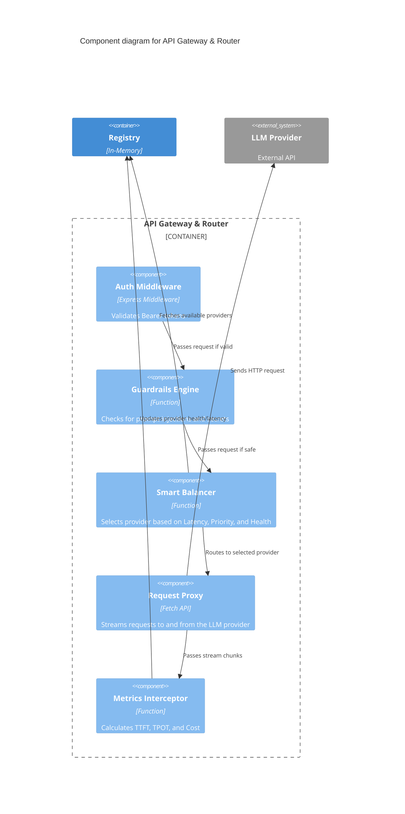

# C4 Component Diagram

```mermaid
C4Component
    title Component diagram for API Gateway & Router

    Container_Boundary(api, "API Gateway & Router") {
        Component(auth_middleware, "Auth Middleware", "Express Middleware", "Validates Bearer tokens")
        Component(guardrails, "Guardrails Engine", "Function", "Checks for prompt injections and secrets")
        Component(balancer, "Smart Balancer", "Function", "Selects provider based on Latency, Priority, and Health")
        Component(proxy, "Request Proxy", "Fetch API", "Streams requests to and from the LLM provider")
        Component(metrics_interceptor, "Metrics Interceptor", "Function", "Calculates TTFT, TPOT, and Cost")
    }

    Container(registry, "Registry", "In-Memory")
    System_Ext(llm, "LLM Provider", "External API")

    Rel(auth_middleware, guardrails, "Passes request if valid")
    Rel(guardrails, balancer, "Passes request if safe")
    Rel(balancer, registry, "Fetches available providers")
    Rel(balancer, proxy, "Routes to selected provider")
    Rel(proxy, llm, "Sends HTTP request")
    Rel(proxy, metrics_interceptor, "Passes stream chunks")
    Rel(metrics_interceptor, registry, "Updates provider health/latency")
```
