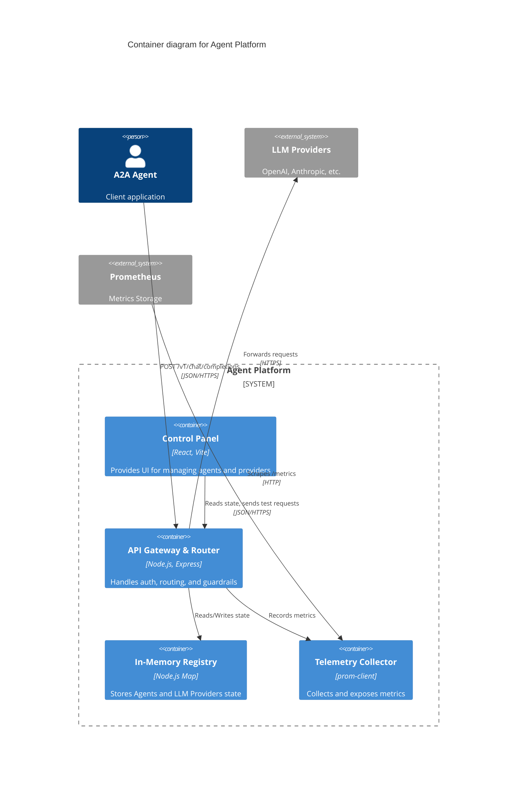

# C4 Container Diagram

```mermaid
C4Container
    title Container diagram for Agent Platform

    Person(agent, "A2A Agent", "Client application")

    System_Boundary(platform, "Agent Platform") {
        Container(frontend, "Control Panel", "React, Vite", "Provides UI for managing agents and providers")
        Container(api_gateway, "API Gateway & Router", "Node.js, Express", "Handles auth, routing, and guardrails")
        Container(registry, "In-Memory Registry", "Node.js Map", "Stores Agents and LLM Providers state")
        Container(telemetry, "Telemetry Collector", "prom-client", "Collects and exposes metrics")
    }

    System_Ext(llm_providers, "LLM Providers", "OpenAI, Anthropic, etc.")
    System_Ext(prometheus, "Prometheus", "Metrics Storage")

    Rel(agent, api_gateway, "POST /v1/chat/completions", "JSON/HTTPS")
    Rel(frontend, api_gateway, "Reads state, sends test requests", "JSON/HTTPS")
    Rel(api_gateway, registry, "Reads/Writes state")
    Rel(api_gateway, telemetry, "Records metrics")
    Rel(api_gateway, llm_providers, "Forwards requests", "HTTPS")
    Rel(prometheus, telemetry, "Scrapes /metrics", "HTTP")
```
