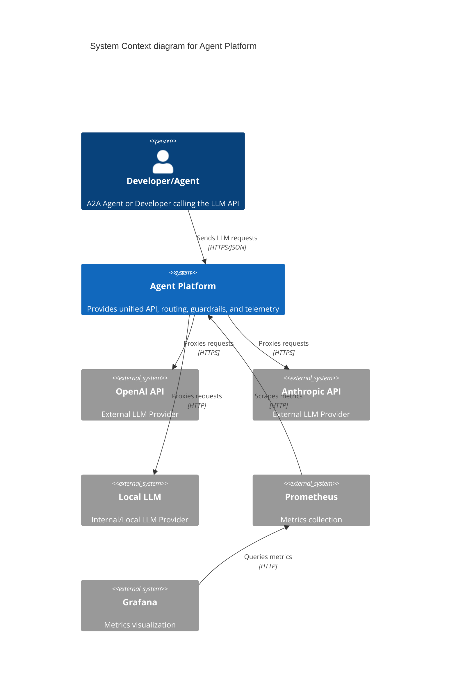

# C4 Context Diagram

```mermaid
C4Context
    title System Context diagram for Agent Platform

    Person(developer, "Developer/Agent", "A2A Agent or Developer calling the LLM API")
    System(agent_platform, "Agent Platform", "Provides unified API, routing, guardrails, and telemetry")
    
    System_Ext(openai, "OpenAI API", "External LLM Provider")
    System_Ext(anthropic, "Anthropic API", "External LLM Provider")
    System_Ext(local_llm, "Local LLM", "Internal/Local LLM Provider")
    System_Ext(prometheus, "Prometheus", "Metrics collection")
    System_Ext(grafana, "Grafana", "Metrics visualization")

    Rel(developer, agent_platform, "Sends LLM requests", "HTTPS/JSON")
    Rel(agent_platform, openai, "Proxies requests", "HTTPS")
    Rel(agent_platform, anthropic, "Proxies requests", "HTTPS")
    Rel(agent_platform, local_llm, "Proxies requests", "HTTP")
    
    Rel(prometheus, agent_platform, "Scrapes metrics", "HTTP")
    Rel(grafana, prometheus, "Queries metrics", "HTTP")
```
