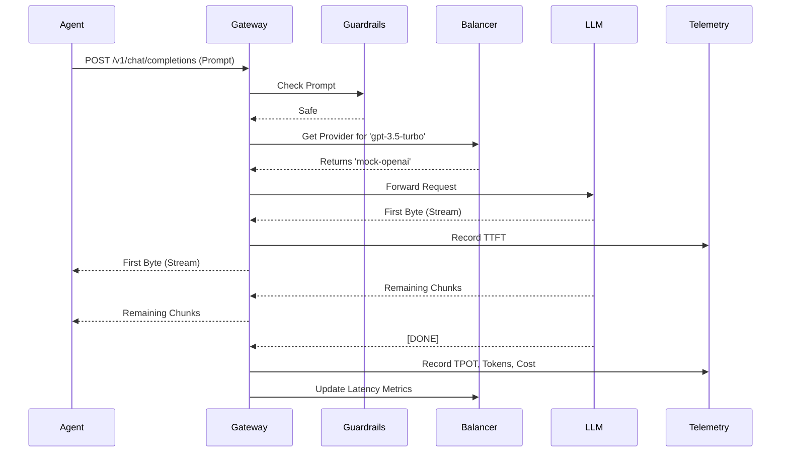

# Data Flow Diagram

```mermaid
sequenceDiagram
    participant Agent
    participant Gateway
    participant Guardrails
    participant Balancer
    participant LLM
    participant Telemetry

    Agent->>Gateway: POST /v1/chat/completions (Prompt)
    Gateway->>Guardrails: Check Prompt
    Guardrails-->>Gateway: Safe
    Gateway->>Balancer: Get Provider for 'gpt-3.5-turbo'
    Balancer-->>Gateway: Returns 'mock-openai'
    Gateway->>LLM: Forward Request
    LLM-->>Gateway: First Byte (Stream)
    Gateway->>Telemetry: Record TTFT
    Gateway-->>Agent: First Byte (Stream)
    LLM-->>Gateway: Remaining Chunks
    Gateway-->>Agent: Remaining Chunks
    LLM-->>Gateway: [DONE]
    Gateway->>Telemetry: Record TPOT, Tokens, Cost
    Gateway->>Balancer: Update Latency Metrics
```
