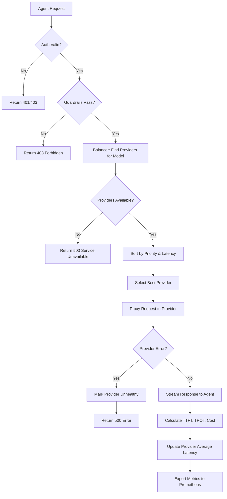

# Workflow Diagram

```mermaid
graph TD
    A[Agent Request] --> B{Auth Valid?}
    B -- No --> C[Return 401/403]
    B -- Yes --> D{Guardrails Pass?}
    D -- No --> E[Return 403 Forbidden]
    D -- Yes --> F[Balancer: Find Providers for Model]
    F --> G{Providers Available?}
    G -- No --> H[Return 503 Service Unavailable]
    G -- Yes --> I[Sort by Priority & Latency]
    I --> J[Select Best Provider]
    J --> K[Proxy Request to Provider]
    K --> L{Provider Error?}
    L -- Yes --> M[Mark Provider Unhealthy]
    M --> N[Return 500 Error]
    L -- No --> O[Stream Response to Agent]
    O --> P[Calculate TTFT, TPOT, Cost]
    P --> Q[Update Provider Average Latency]
    Q --> R[Export Metrics to Prometheus]
```
